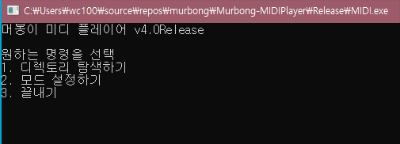
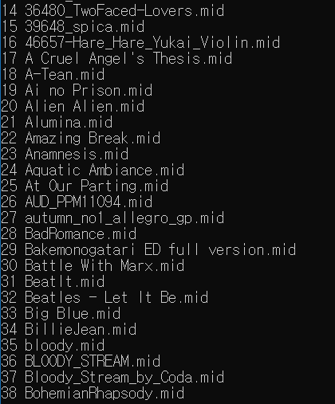
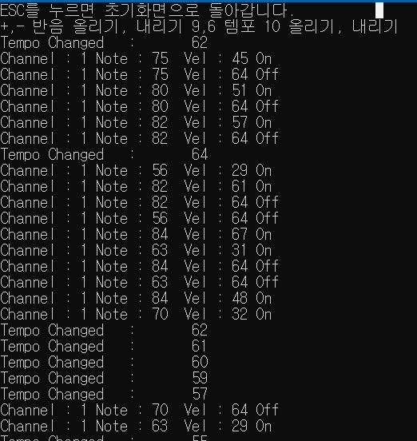
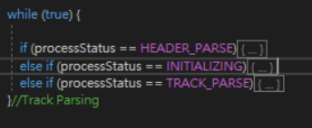
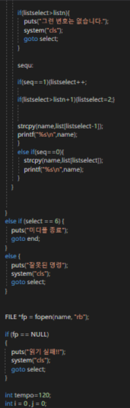
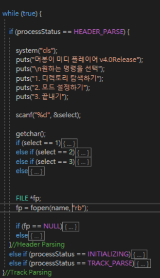

# #MIDI Player

> 프로그램 종류 : 파일 파싱 프로그램, 미디어 플레이어     
>
> 사용 언어 :Visual C++
>
> 사용 라이브러리 : winmm.lib
>
> 프로젝트 소스 링크 : https://github.com/murbong/Murbong-Midiplayer

------

## 설명

최초의 Midi Player는 "Garry's mod" 게임에서의 스크립트이다. 이 스크립트를 C로 이식한 프로그램이 바로 버전 1.0 Midi Player이다.

> 2년전 조회수 7000을 기록한 유튜브 영상 https://youtu.be/X46nYrrEdeU



### 기능 설명

------

### 디렉토리 탐색하기

> 현재 디렉토리의 모든 .mid 파일을 배열로 가져온다.



> Play 하고 싶은 번호를 누르면 파일이 로드되면서 미디를 분석한다.



> 실행도중 +,-,9,6을 누르면 미디 파일 높낮이, 템포를 변경할 수 있다.

------

## 소스 코드

> 자세한 MIDI File Structure는 [document/midi.md](document/midi.md) 를 참조해주세요.



작업은 세 가지로 나눠진다.

1. header parsing 
2. initializing
3. track parsing

header parsing 작업에서는 파일 불러오기, 파일 헤더 분석 등을 한다. 파일 불러오기 메뉴는 콘솔로 작성된다.

initializing 작업은 시작 시간, 높낮이, 템포, 트랙 종료 카운트를 초기화한다.

track parsing 작업에서는 모든 트랙이 끝날때 까지 분석하고, 이를 콘솔창과 오디오로 출력합니다. 또한 콘솔에서 키 입력을 받을시, 알맞는 동작을 수행한다.

미디 바이너리 읽기

```c
tracksdata[i].trackRaw = (BYTE *)malloc(sizeof(BYTE)*(tracksdata[i].trackLength + 1));
```

tracksdata의 binary는 동적으로 할당되어, 파일 포인터에서 지정된 Length만큼 불러온다.

> 가장 난제였던 것은  '어떻게 Binary를 자를까?'  였다...

```c
void Sub(BYTE * out, BYTE * word, int cnt, int * tracklength)
{
	if ((*tracklength) < cnt) return;//tracklength가 count보다 작으면 함수를 종료한다.
memcpy(out, word, cnt);//out에 현재 트랙에서 왼쪽부터 cnt만큼 복사한다.
(*tracklength) -= cnt;
memcpy(word, word + cnt, *tracklength);// 현재 트랙을 cnt만큼 왼쪽부터 없앤다.

}
```

트랙마다 트랙의 크기인 tracklength를 두고, 이미 읽은 트랙 바이트를 삭제하는 함수를 만들었다.

또한 Binary를 Int형으로 바꿔야 할 때도 있는데,

```c
int BinaryToNumber(BYTE * raw, int cnt) {
	int res = 0;
	int i;
	if (cnt == 1) { return *raw; }
	else {
		for (i = 1; i <= cnt; i++) {
			res += raw[i - 1] << (cnt - i) * 8;
		}
	}
	return res;
}
```

1바이트씩 불러서 BitLeftShift를 하여 int형으로 바꿔주었다.

```c
		if (endCount == trackCount) {
			for (i = 1; i <= trackCount; i++) {

				free(tracksdata[i].trackRaw);
				tracksdata[i].trackEnd = false;
				printf("채널 %d 닫기 성공!\n", i);
			}

			printf("미디 닫기 성공!\n");

			processStatus = HEADER_PARSE;//처음으로 돌아간다.
			Midi_AllChannelSoundOff(m_DevHandle);
		}
```

C에는 GC(Garbage Collector)가 없기에, 모든 메모리는 누수를 막기 위해 사용 후 free를 해야한다.

------

###업데이트, 버그 해결

초기의 소스코드는 무분별한 포인터 사용과 goto문, 템포 이슈 등등으로 기능 추가가 어려운 상태였다.

몇번의 버전 업 끝에 가독성 강화와 버그 해결로 다른 오픈소스(java) 미디 플레이어보다 빠른 성능, 음 높낮이 조절, 여러가지 모드 등을 탑재했다.



> goto문으로 인해 코드의 순서를 모르는 상황. 순서가 뒤죽박죽이고 보기에도 힘들다.



> goto를 while로 바꾼뒤, 작업 순서를 DEFINE 하여 가독성이 좋게 처리되었다.


버그 이슈에서는 트랙이 각자 진행되는 버그가 있었는데, 가령 tempo switch가 첫번째 트랙이 아닌, 중간 트랙에 있을때 발생했다.


> tracksdata[i].tracktime += (float)(60 * dt) / (tempo*timing0tpq);

이렇게 되면, 초반 Track은 템포 120으로, 후반 Track은 템포 180으로 지정되는 불상사가 일어난다. 그래서...

> curTime += 1 * ((tempo + tempoFix )*timingTPQ);
>
> Sleep(1);
>
> tracksdata[i].trackTime += (float)(60 * deltaTime);

clock을 쓰지 않고, 자체 tempo tick을 만들어서 사용했지만 While문에서 Sleep이 중첩되어 읽기가 느려진다는 단점이 있었다. 그래서...

> if (Timer <= clock() - 0.001) {
> ​	curTime += 1 * ((tempo + tempoFix )*timingTPQ);
> ​	Timer = clock();
> }
>
> tracksdata[i].trackTime += (float)(60 * deltaTime);

최종적으로 이렇게 변해, 하나의 Global Tempo Timer를 만들었다.

------

## VirtualPiano Mapping

이제 이걸 어디다 써먹을수 있을까?

> https://virtualpiano.net/ 온라인 가상 키보드 프로그램

Midi Note에 따라서 키보드를 맵핑하면 오토피아노가 된다...

1부터 M까지 맵핑되있고, 반음은 Shift로 구성되어있으니...

```c
BYTE MKey[] = {
	'1','1','2','2','3',//미
	'4','4','5','5','6','6','7',//시
	'8','8','9','9','0',
	'q','q','w','w','e','e','r',
	't','t','y','y','u',
	'i','i','o','o','p','p','a',
	's','s','d','d','f',
	'g','g','h','h','j','j','k',
	'l','l','z','z','x',
	'c','c','v','v','b','b','n',
	'm' }; 
	BYTE NoteSharp[] = { 37,49,61,73,85,39,51,63,75,87,42,54,66,78,90,44,56,68,80,92,46,58,70,82,94 };
```

이것을 Note와 1대1 매칭할려면,

> char Key = MKey[Note - 36]//왜냐하면  25번째 t가  Note에서는 60번째이기 때문에, 60-36 = 24. 즉 t는 MKey[24]이다.
>
> for (int i = 0; i <= 24; i++) {
> ​	if (Note== NoteSharp[i]) {
> ​		Shift = 1;
> ​		break;
> ​	}
> }

keybd_event나 sendInput으로 키보드를 작동시키면 맵핑 완료.

### 작동 예제

> https://youtu.be/LB_zRYZuRH8  // Pitch Up down 이전 버전
>
> https://youtu.be/EZ7GiDeiT7k // Virtual Piano

------


